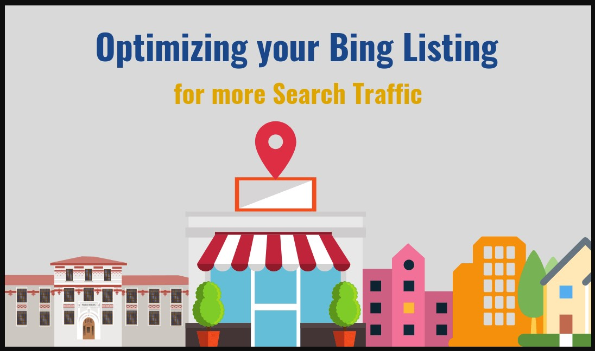

# Bing Listing: Add Your Business to Bing

### How do I claim my Bing listing?

 [_**Bing places for business**_](https://www.bingplaces.com/) is a **FREE** service using which you can manage your **business** listing on **Bing** Search and Maps. - Add latest photos of your **business** \(storefront, interiors etc.\)

**How to Claim** Your [**Bing Listing** ](https://www.brightlocal.com/learn/how-to-add-or-claim-a-bing-places-for-business-listing/)or Add Your Business to **Bing**

1. Step 1: Get Started. Go to **Bing** Places. ...
2. Step 2: Enter business details. You should be redirected to a page with the following form. ...
3. Step 3: **Claim** Your Business. The search results should return your business **listing**. ...
4. Step 4: Cross-check your Business Information. ...
5. Step 5:Verify Your Business **Listing**.

