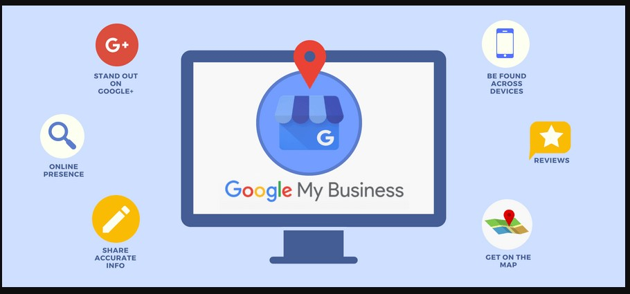

# Google My Business GMB

Google My Business is a free and easy-to-use tool for businesses and organizations to manage their online presence across Google, including Search and Maps. To help customers find your business, and to tell them your story, you can verify your business and edit your business information.

* Keywords in GMB Services
* Enabling GMB Messaging
* Keywords in GMB Products
* Keywords in Google Posts
* Enabling an Appointment URL
* Frequency of Google Posts
* Quantity of Google Posts

A feature like Google’s Local Search emphasizes the need for a GMB listing for both new and established businesses.

It gives a list of businesses nearby and a lot of information needed to find a specific business like:

* Business address.
* Business hours.
* Category.
* Reviews.

**How to set up Google My Business**

1. **Step** 1: Sign in to **Google My Business**. Go to www.**google**.com/**business** to sign in. ...
2. **Step** 2: Add your **business**. Enter your **business** name. ...
3. **Step** 3: Enter your location. ...
4. **Step** 4: Fill in your contact information. ...
5. **Step** 5: Finish and manage your listing.

### Optimize your Google My Business listing 

To start, you need to claim your listing. After that, you can use the following tips to make your My Business account a success. Keep in mind that everything you add must be in line with the information you provide on your site. Inaccurate information kills your listings and could kill your rankings:

* Claim your listing with your actual business name
* Choose a category as accurate as possible
* Provide as much data as you can – your profile has to be 100%
* Check your phone number
* Check your opening times – think about holidays!
* Review your photos – are they accurate and good or can you improve them?
* Create citations on other sites as well – pick well-regarded business listing or review sites and directories, stay away from spammers
* Keep your My Business listing in line with your site – and use Schema.org data
* Above all, keep your data up to date

