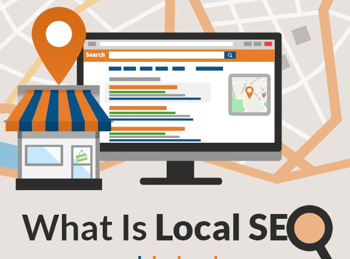

# What Is LOcal SEO

Suppose, If you have a local business, like a shop, or have people visiting your office frequently, optimizing your [**website**](https://imamuddinwp.github.io/imamuddin/) is also about making sure people are able to find you in real life. Even now, when you’re not actively getting visitors in your building, you’re still targeting an audience that is located in the same geographical area as you are. So you need to optimize for that area! This is what we call “[**local SEO**](https://imamuddin.business.site/).” 

 **Local SEO** is merely a variation of your run-of-the-mill **SEO**, and is aimed at making sure your business gets found on search engines like Google and Bing, by people searching for it at that locality.

